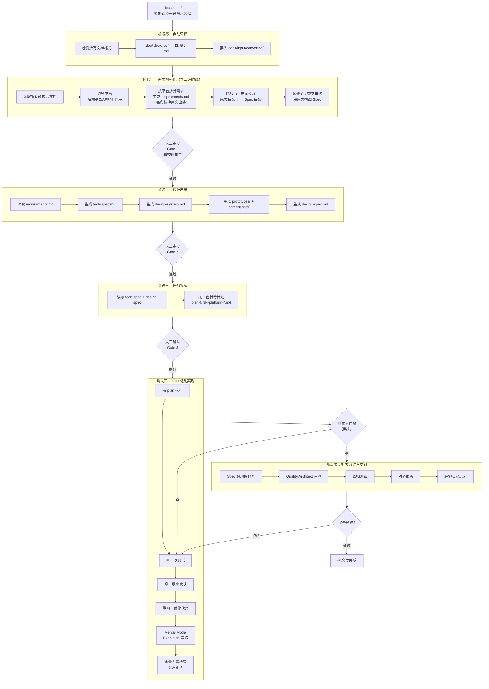

# 规范驱动开发工作流 v3（BMAD + Superpowers + BOSS 融合版）

> **适用场景**：已有需求文档（PRD / 用户故事 / 业务说明），需要系统化地产出设计、规范、需求和设计的 Spec，然后通过 TDD 实现功能，且最终代码必须与设计和需求 Spec 严格对齐。
>
> **核心理念**：Superpowers 的纪律性（Approval Workflow、TDD、Mental Model Execution）+ BMAD 的流程性（角色体系、Spec 驱动）+ BOSS 的工具化（自动转换、质量门禁、经验沉淀、流水线自动化）。

---

## 目录

- [0. 快速启动](#0-快速启动)
- [1. 核心理念与设计原则](#1-核心理念与设计原则)
- [2. 项目目录结构](#2-项目目录结构)
- [3. 前置条件与环境配置](#3-前置条件与环境配置)
- [4. 工作流总览](#4-工作流总览)
- [5. 阶段零：需求文档自动转换](#5-阶段零需求文档自动转换)
- [6. 阶段一：需求规格化（含多平台拆分 + 防漂移校验）](#6-阶段一需求规格化)
- [7. 阶段二：设计产出](#7-阶段二设计产出)
- [8. 阶段三：任务拆解](#8-阶段三任务拆解)
- [9. 阶段四：TDD 驱动实现](#9-阶段四tdd-驱动实现)
- [10. 阶段五：对齐验证与交付](#10-阶段五对齐验证与交付)
- [11. 流水线自动化运行机制](#11-流水线自动化运行机制)
- [12. 多 IDE 适配指南](#12-多-ide-适配指南)
- [13. 命令速查表](#13-命令速查表)
- [14. 技能体系](#14-技能体系)
- [15. 最佳实践](#15-最佳实践)
- [16. 故障排查](#16-故障排查)

---

## 0. 快速启动

### 0.1 一键初始化

```bash
# Windows (PowerShell)
.\init-project.ps1

# Mac / Linux
chmod +x init-project.sh && ./init-project.sh
```

脚本自动完成：创建 `docs/` 目录结构 → 生成 IDE 配置文件 → 创建经验库索引 → 检查工作流文档。

### 0.2 初始化后的下一步

1. 将需求文档放入 `docs/input/`（支持 `.md` / `.doc` / `.docx` / `.pdf` / `.txt`，**多个文档可混合放入**）
2. 在 AI IDE 中发送**阶段零+一联合提示词**（见 [§5](#5-阶段零需求文档自动转换) 和 [§6](#6-阶段一需求规格化)）：

```
流水线执行阶段 0+1：
1. 自动检测 docs/input/ 下所有需求文档，将 .doc/.docx/.pdf 转换为 .md
2. 读取转换后的所有需求文档
3. 识别需求涉及的平台（后端/PC客户端/APP/小程序等），按平台拆分需求
4. 生成需求规格写入 docs/specs/requirements.md
5. 生成需求反向校验报告写入 docs/reports/req-validation-NNN.md
```

3. 人工审批 Gate 1 后，发送 `流水线执行阶段 2` 即可自动接力设计产出阶段。

> **关键改进**：除了 3 个人工审批门禁（Gate 1/2/3），其余步骤均可流水化自动运行。详见 [§11](#11-流水线自动化运行机制)。

---

## 1. 核心理念与设计原则

### 1.1 三层融合体系

| 治理层 | 来源 | 真理来源 | 管什么 |
|--------|------|----------|--------|
| **BMAD Method** | 角色体系 + Spec 文档 | `docs/` 目录的 Markdown 文档 | 做什么（需求、设计、架构） |
| **Superpowers** | 纪律规则 | 测试用例 + IDE 角色配置 | 怎么做（TDD、审批、审查、Mental Model） |
| **BOSS 工具化** | 经验沉淀 + 质量门禁 + 自动流水线 | `docs/learning/` + 门禁检查 | 怎么做对（防漂移、防遗漏、自动校验） |

### 1.2 七大设计原则

| # | 原则 | 说明 | 解决的问题 |
|---|------|------|------------|
| 1 | **文档即真理** | 所有变更先改 `docs/specs/` 下的 Spec，再改代码 | 代码偏离设计 |
| 2 | **测试即真理** | 测试用例必须覆盖所有验收标准，代码必须通过全部测试 | 功能不完整 |
| 3 | **需求反向校验** | AI 理解完需求后，必须反向校验：原文每条需求是否都有对应 Spec 条目？Spec 是否有原文未提及的内容？ | ❌ 需求多了/少了 |
| 4 | **平台精准拆分** | 混合 PRD 必须按平台（后端/PC/APP/小程序）拆分需求，每个平台独立编号 | ❌ 不同平台需求串台 |
| 5 | **YAGNI 严格执行** | 禁止添加 Spec 未提及的功能，禁止"顺便"实现需求文档中没有的东西 | ❌ 需求被擅自发挥 |
| 6 | **经验自动沉淀** | 每次踩坑/教训自动写入 `docs/learning/LEARNING.md`，下次任务自动加载 | 知识不流失 |
| 7 | **流水线自动接力** | 阶段间自动衔接，人工只参与审批门禁，其余全自动 | 效率最大化 |

### 1.3 防需求漂移机制（核心创新）

> 这是对"需求不对齐，多了或者少了"问题的系统性解决方案。

```
原始需求文档 ──→ [AI 理解] ──→ 需求规格 Spec
       │                              │
       │         ←──[反向校验]───     │
       │                              │
       └──[逐条比对]──→ 校验报告
            原文每条 ←→ Spec 每条
            多了？少了？平台归属对吗？
```

**三道防线：**

| 防线 | 时机 | 检查内容 | 输出 |
|------|------|----------|------|
| **防线 A：正向提取** | AI 生成 Spec 时 | 每条 Spec 必须标注原文出处段落 | Spec 中每条 REQ 附 `> 来源：prd.md §3.2 原文第 3 段` |
| **防线 B：反向校验** | Spec 生成后立即 | 逐条扫描原文，检查是否有需求未被 Spec 覆盖 | `docs/reports/req-validation-001.md` |
| **防线 C：交叉审问** | 人工审批前 | 用原始需求"审问"Spec：领域模型是否冲突？术语是否一致？平台归属是否正确？ | `docs/reports/req-grill-001.md` |

---

## 2. 项目目录结构

```
project-root/
│
├── docs/                              # ★ 所有规范文档（IDE 无关，项目级）
│   ├── input/                         # 原始需求文档（PRD、用户故事等）
│   │   ├── prd-backend.docx           #   后端需求（Word）
│   │   ├── prd-app.pdf                #   APP 需求（PDF）
│   │   ├── prd-pc.md                  #   PC 客户端需求（Markdown）
│   │   └── converted/                 #   自动转换后的 Markdown（不手动放）
│   │       ├── prd-backend.md
│   │       ├── prd-app.md
│   │       └── prd-pc.md
│   │
│   ├── specs/                         # 规格文档（"绝对真理"层）
│   │   ├── requirements.md            # 需求规格（按平台分区编号）
│   │   ├── design-spec.md             # 设计规格
│   │   └── tech-spec.md              # 技术设计规格
│   │
│   ├── design/                        # 设计产出物
│   │   ├── design-system.md           # 设计规范
│   │   ├── prototypes/                # HTML 原型
│   │   │   └── *.html
│   │   └── screenshots/              # 设计截图
│   │       └── *.png
│   │
│   ├── plans/                         # 原子化任务计划（按平台分文件）
│   │   ├── plan-001-backend-xxx.md
│   │   ├── plan-002-pc-xxx.md
│   │   ├── plan-003-app-xxx.md
│   │   └── ...
│   │
│   ├── reports/                       # 审查报告与对齐验证报告
│   │   ├── req-validation-001.md      #   需求反向校验报告
│   │   ├── req-grill-001.md           #   需求交叉审问报告
│   │   ├── alignment-report.md        #   Spec 对齐报告
│   │   ├── test-coverage-report.md    #   测试覆盖报告
│   │   └── delivery-report.md         #   交付报告
│   │
│   └── learning/                      # ★ 经验库（BOSS 式知识沉淀）
│       ├── LEARNING.md                #   经验索引表（触发条件 + 文件路径）
│       └── entries/                  #   经验全文
│           ├── platform-split-traps.md
│           └── ...
│
├── .claude/                           # Claude Code 专用配置（可选）
│   ├── instructions.md                #   全局规则与纪律
│   ├── project-context.md             #   项目上下文
│   └── roles/                         #   角色定义文件
│
├── .cursor/rules/                     # Cursor / CatPaw 角色规则
├── CLAUDE.md                          # Claude Code 入口
├── AGENTS.md                          # Codex / CatPaw 入口
├── DEVELOPMENT_WORKFLOW.md            # 本文档
└── src/                               # 项目源代码
```

### 2.1 目录职责说明

| 目录 | 职责 | 谁写入 | IDE 依赖 |
|------|------|--------|----------|
| `docs/input/` | 存放原始需求文档（支持多格式多平台混合） | 人工 | 无 |
| `docs/input/converted/` | 自动转换后的 Markdown | AI 自动生成 | 无 |
| `docs/specs/` | 需求/设计/技术 Spec（真理层） | AI 生成 + 人工审批 | 无 |
| `docs/design/` | 设计规范、原型、截图 | AI 生成 + 人工审批 | 无 |
| `docs/plans/` | 原子化任务计划（按平台分文件） | AI 生成 + 人工确认 | 无 |
| `docs/reports/` | 校验报告、审查报告、对齐报告 | AI 自动生成 | 无 |
| `docs/learning/` | 经验索引 + 经验全文 | AI 自动沉淀 + 人工补充 | 无 |
| `.claude/` 等 | 角色定义、纪律规则 | 安装器或人工 | 绑定特定 IDE |

---

## 3. 前置条件与环境配置

### 3.1 通用前置条件

1. **Node.js 18+** 已安装（运行 `node -v` 确认）
2. **已有需求文档**（支持 `.md` / `.doc` / `.docx` / `.pdf` / `.txt`，**可多文档多格式混合**）
3. **AI 编码 IDE** 已安装（CatPaw / Claude Code / Cursor / Codex / Windsurf / GitHub Copilot 等任选其一）
4. **（推荐）pandoc 已安装**（用于自动转换 Word/PDF，下载地址：https://pandoc.org/installing.html）

### 3.2 安装 BMAD Method（可选，推荐）

```bash
# 克隆 BMAD Method 仓库到项目中
git clone https://github.com/bmad-code-org/BMAD-METHOD.git .bmad-temp
# 按照仓库中的安装说明，将 agents 目录复制到项目中
# BMAD 的 agent 文件通常位于：src/bmm/agents/ 或 _bmad/bmm/agents/ 或 .bmad/agents/
```

> BMAD 提供完整角色体系（Analyst / Architect / PM / Dev / QA），推荐安装。未安装时 Superpowers 以独立模式运行。

### 3.3 安装 Superpowers

```bash
npm install -g @agilite-2025/superpowers
npx @agilite-2025/superpowers   # 在项目根目录运行安装器
```

### 3.4 初始化项目文档结构

```bash
mkdir -p docs/input/converted docs/specs docs/design/prototypes docs/design/screenshots docs/plans docs/reports docs/learning/entries
```

---

## 4. 工作流总览



### 阶段总览表

| 阶段 | 名称 | 输入 | 产出 | 角色 | 门禁 | 自动化 |
|------|------|------|------|------|------|--------|
| 零 | 文档转换 | `docs/input/*.{doc,docx,pdf}` | `docs/input/converted/*.md` | 自动 | 无 | ✅ 全自动 |
| 一 | 需求规格化 | 转换后所有 `.md` | `requirements.md` + 校验报告 | Analyst | Gate 1 | ⚡ 除审批外自动 |
| 二 | 设计产出 | `requirements.md` | `design-system` + `prototypes` + `design-spec` + `tech-spec` | Architect | Gate 2 | ⚡ 除审批外自动 |
| 三 | 任务拆解 | `tech-spec` + `design-spec` | `plans/plan-NNN-platform-*.md` | Planner | Gate 3 | ⚡ 除审批外自动 |
| 四 | TDD 实现 | `plans/` + 所有 Spec | 源代码 + 测试代码 | Developer | 测试+门禁全绿 | ⚡ 循环自动 |
| 五 | 对齐验证 | 代码 + 测试 + Spec | `reports/` + `learning/` | Quality Architect | 审查通过 | ⚡ 除审批外自动 |

---

## 5. 阶段零：需求文档自动转换

### 5.1 目标

将 `docs/input/` 下的所有非 Markdown 需求文档自动转换为 Markdown，**无需人工干预**。

### 5.2 自动转换逻辑

```
扫描 docs/input/ 目录下所有文件：
  ├── .md 文件 → 直接使用，跳过转换
  ├── .doc / .docx 文件 → 使用 pandoc 转换为 .md
  ├── .pdf 文件 → 使用 pymupdf 或 pandoc 转换为 .md
  ├── .txt 文件 → 复制为 .md
  └── 其他格式 → 记录到警告清单

转换结果存入 docs/input/converted/ 目录
如果包含图片，提取到 docs/input/converted/media/
```

### 5.3 流水线提示词

```
流水线阶段 0：自动转换需求文档

请执行以下操作：
1. 扫描 docs/input/ 目录下所有文件（不含 converted/ 子目录）
2. 对每个非 .md 文件，自动转换为 Markdown：
   - .doc/.docx → 使用 pandoc 转换（如 pandoc 可用）
   - .pdf → 使用 pymupdf 或 pandoc 转换
   - .txt → 直接复制为 .md
3. 转换结果存入 docs/input/converted/ 目录，保持原文件名但扩展名改为 .md
4. 如文档包含图片，提取到 docs/input/converted/media/
5. 生成转换清单写入 docs/input/converted/CONVERSION_LOG.md，记录：
   - 原始文件名 → 转换后文件名
   - 格式 → 格式
   - 是否包含图片 → 图片数量
   - 转换状态（成功/失败/跳过）
6. 如 pandoc 未安装，提示安装命令但继续尝试其他方式

完成后自动进入阶段一。
```

### 5.4 转换后验证

转换完成后，自动检查：
- 转换后的 `.md` 文件是否非空
- 是否有图片丢失
- 中文是否乱码

如发现问题，记录到 `CONVERSION_LOG.md` 的警告部分，不阻断流程但提示人工检查。

---

## 6. 阶段一：需求规格化

### 6.1 目标

将转换后的需求文档转化为结构化的**需求规格说明书**，包含：
- 按平台（后端/PC客户端/APP/小程序等）精准拆分需求
- 用户故事、验收标准、边界场景
- 每条需求标注原文出处
- 通过三道防线校验，防止需求多了/少了

### 6.2 产出物

| 文件 | 说明 |
|------|------|
| `docs/specs/requirements.md` | 需求规格（按平台分区编号） |
| `docs/reports/req-validation-001.md` | 需求反向校验报告（防线 B） |
| `docs/reports/req-grill-001.md` | 需求交叉审问报告（防线 C） |

### 6.3 流水线提示词

```
流水线阶段 1：需求规格化（含三道防线）

你是需求分析师（Analyst）。请严格按以下步骤执行：

═══════════════════════════════════════
步骤 1：读取所有需求文档
═══════════════════════════════════════
读取 docs/input/converted/ 目录下所有 .md 文件。
记录每个文件的来源和平台属性。

═══════════════════════════════════════
步骤 2：识别平台并拆分需求
═══════════════════════════════════════
识别需求文档涉及的目标平台。常见平台包括：
- 后端（Backend）：API、服务端逻辑、数据库
- PC 客户端（PC）：桌面端页面、PC 专属功能
- APP（Mobile）：移动端页面、移动端专属功能
- 小程序（MiniProgram）：微信/支付宝小程序
- 其他平台

规则：
- 如果一个功能同时涉及多个平台，在每个平台分区都列出，但标注"跨平台共享需求"
- 后端 API 如果同时服务 PC 和 APP，在后端需求下列出，PC/APP 分区只列前端消费行为
- 不确定平台归属时，列入"待确认平台"分区，不要擅自归类

═══════════════════════════════════════
步骤 3：生成需求规格
═══════════════════════════════════════
写入 docs/specs/requirements.md，格式要求：

A. 平台分区编号：
   - 后端需求：REQ-BE-001, REQ-BE-002, ...
   - PC 需求：REQ-PC-001, REQ-PC-002, ...
   - APP 需求：REQ-APP-001, REQ-APP-002, ...
   - 跨平台共享：REQ-XP-001, ...

B. 每条需求的用户故事格式：
   作为[角色]，我想要[功能]，以便[价值]

C. 每条需求的验收标准（GWT 格式）：
   AC-BE-001-01：Given [前置] When [操作] Then [结果]

D. 覆盖正常流程、异常流程和边界场景

E. 【防线 A】每条 REQ 必须标注原文出处：
   > 来源：prd-backend.md §3.2 "用户管理" 第 2 段
   > 来源：prd-app.md §5.1 "登录功能"

F. 禁止使用"待定"、"TBD"等模糊表述
G. 如信息不足，在"待确认问题清单"中列出
H. 【YAGNI】禁止添加需求文档中未提及的任何功能

═══════════════════════════════════════
步骤 4：防线 B —— 反向校验
═══════════════════════════════════════
生成 docs/reports/req-validation-001.md，执行以下校验：

校验 1：需求遗漏检查
  - 逐条扫描每个原始需求文档的每个段落
  - 检查该段落的需求数是否在 requirements.md 中有对应条目
  - 输出格式：
    | 原文位置 | 原文摘要 | 对应 Spec 编号 | 状态 |
    | prd-backend.md §1.1 | "用户注册" | REQ-BE-001 | ✅ 已覆盖 |
    | prd-app.md §3.2 | "指纹登录" | — | ❌ 未覆盖 |

校验 2：需求多余检查
  - 逐条扫描 requirements.md 中的每个 REQ
  - 检查该 REQ 是否能在原始需求文档中找到依据
  - 输出格式：
    | Spec 编号 | Spec 摘要 | 原文依据 | 状态 |
    | REQ-BE-003 | "导出Excel" | prd-backend.md §4.1 | ✅ 有依据 |
    | REQ-PC-005 | "暗色模式" | — | ⚠️ 原文未提及，可能多余 |

校验 3：平台归属检查
  - 检查每条 REQ 的平台分类是否正确
  - 例如：API 定义应归后端，不应归 PC
  - 输出格式：
    | Spec 编号 | 当前平台 | 建议平台 | 理由 |

═══════════════════════════════════════
步骤 5：防线 C —— 交叉审问
═══════════════════════════════════════
生成 docs/reports/req-grill-001.md，用原始需求"审问"Spec：

审问维度：
1. 术语一致性：Spec 中的术语是否与原文一致？（如原文叫"工单"，Spec 不应写成"任务单"）
2. 业务规则冲突：Spec 中是否有两条需求互相矛盾？
3. 平台串台：APP 专属功能是否被误放到 PC 分区？
4. 范围溢出：Spec 是否添加了原文没有的功能？（YAGNI 违规）
5. 范围缺失：原文明确要求但 Spec 遗漏的功能？
6. 验收标准可测性：每条 AC 是否可以用测试用例验证？

每条审问结果格式：
  **问题**：[一行摘要]
  **原文依据**：[原文段落引用]
  **Spec 位置**：[requirements.md 中的 REQ 编号]
  **审问结论**：[通过 / 需修改]
  **修改建议**：[如需修改，具体建议]

═══════════════════════════════════════
步骤 6：加载经验库
═══════════════════════════════════════
读取 docs/learning/LEARNING.md 索引表。
如果存在与"需求分析"或"平台拆分"相关的经验条目，
读取全文并在生成 Spec 时遵循。
如有新经验（本次分析中发现的踩坑/教训），
追加到 LEARNING.md 索引表并写入 docs/learning/entries/。

完成后等待人工审批 Gate 1。
```

### 6.4 人工审批（Gate 1）

**审批时必须查看的文件：**

1. `docs/specs/requirements.md` — 需求规格本身
2. `docs/reports/req-validation-001.md` — **重点看**：有没有 ❌ 未覆盖、⚠️ 可能多余
3. `docs/reports/req-grill-001.md` — **重点看**：有没有"需修改"的审问结论

**审批检查清单：**

- [ ] 需求规格是否按平台正确拆分？
- [ ] 校验报告中有没有"未覆盖"的需求？（少了）
- [ ] 校验报告中有没有"可能多余"的需求？（多了）
- [ ] 交叉审问有没有发现术语不一致或平台串台？
- [ ] 待确认问题清单是否需要现在解决？

**门禁规则**：审批通过前，不得进入阶段二。如有修改，直接编辑 `requirements.md` 或要求 AI 修正后重新审批。

### 6.5 需求规格文档模板

```markdown
# 需求规格（Requirement Spec）

> 来源文档：docs/input/converted/prd-backend.md, prd-app.md, prd-pc.md
> 状态：[ ] 草稿 → [ ] 已审批 → [x] 已锁定
> 最后更新：YYYY-MM-DD
> 校验报告：docs/reports/req-validation-001.md
> 审问报告：docs/reports/req-grill-001.md

## 1. 概述
### 1.1 项目目标
### 1.2 范围与约束
### 1.3 平台清单
- 后端（Backend）
- PC 客户端（PC）
- 移动端 APP（APP）

## 2. 后端需求

### REQ-BE-001：[功能名称]
**用户故事**：作为[角色]，我想要[功能]，以便[价值]

**验收标准**：
- AC-BE-001-01：Given [前置] When [操作] Then [结果]
- AC-BE-001-02：Given [前置] When [操作] Then [结果]

**边界场景**：
- [边界场景 1]
- [边界场景 2]

> 来源：prd-backend.md §3.2 "用户管理" 第 2 段

### REQ-BE-002：[功能名称]
...

## 3. PC 客户端需求

### REQ-PC-001：[功能名称]
...

## 4. 移动端 APP 需求

### REQ-APP-001：[功能名称]
...

## 5. 跨平台共享需求

### REQ-XP-001：[功能名称]
> 同时影响 PC 和 APP 的需求

## 6. 非功能需求
### 6.1 性能要求
### 6.2 安全要求
### 6.3 兼容性要求

## 7. 待确认问题清单
- [ ] 问题 1：[描述]
- [ ] 问题 2：[描述]
```

---

## 7. 阶段二：设计产出

### 7.1 目标

基于需求规格，产出以下四类设计资产。

### 7.2 产出物

| 产出物 | 路径 | 说明 |
|--------|------|------|
| 技术 Spec | `docs/specs/tech-spec.md` | 技术栈、架构、API 定义、数据模型 |
| 设计规范 | `docs/design/design-system.md` | 色彩、字体、间距、组件规范 |
| 设计原型 | `docs/design/prototypes/*.html` | 页面布局原型（按平台区分） |
| 设计 Spec | `docs/specs/design-spec.md` | 页面规格、组件规格、交互逻辑 |

### 7.3 流水线提示词

```
流水线阶段 2：设计产出

请按以下顺序自动执行（阶段间无需人工确认）：

═══════════════════════════════════════
步骤 1：生成技术 Spec
═══════════════════════════════════════
读取 docs/specs/requirements.md，生成 docs/specs/tech-spec.md

要求：
- 技术栈选型与版本（明确指定版本号）
- 按平台划分技术方案（后端/PC/APP 可能技术栈不同）
- API 接口定义（请求/响应 JSON Schema），标注服务于哪些平台的 REQ
- 数据模型（表结构 / ER 关系 / TypeScript 类型定义）
- 模块划分与职责边界
- 非功能需求（性能指标、安全策略、可扩展性方案）
- 每个章节编号（如 §4.2.3），便于后续代码引用对齐
- 禁止"待定"、"后续实现"等模糊表述
- 每个技术决策必须能追溯到 requirements.md 中的某个 REQ

═══════════════════════════════════════
步骤 2：生成设计规范
═══════════════════════════════════════
读取 requirements.md + tech-spec.md，生成 docs/design/design-system.md

要求：
- 色彩系统（主色、辅助色、语义色，含 HEX/RGB 值）
- 排版系统（字体族、字号梯度、行高、字重）
- 间距系统（基准间距单位和梯度）
- 组件规范（按钮、输入框、卡片、导航等核心组件的状态与样式）
- 按平台区分设计规范（PC 和 APP 的规范可能不同）
- 响应式断点定义
- 暗色/亮色模式（如适用）

═══════════════════════════════════════
步骤 3：生成设计原型
═══════════════════════════════════════
基于 requirements.md + tech-spec.md + design-system.md，
为每个核心页面生成独立的 HTML 原型文件，放入 docs/design/prototypes/。

要求：
- 文件名格式：{平台}-{页面名}.html（如 pc-login.html, app-home.html）
- 内联 CSS（使用 design-system.md 中定义的样式变量）
- 展示完整的页面布局和组件排布
- 包含交互状态演示（hover、active、disabled 等）
- 使用真实数据的占位内容（非 lorem ipsum）
- 可直接在浏览器中打开预览
- 每个原型必须标注对应的 REQ 编号

═══════════════════════════════════════
步骤 4：生成设计 Spec
═══════════════════════════════════════
读取 requirements.md + tech-spec.md + design-system.md，
生成 docs/specs/design-spec.md

要求：
- 按平台分区（后端 API 规格 / PC 页面规格 / APP 页面规格）
- 页面规格：每个页面的布局结构、组件构成、数据展示规则
- 组件规格：每个组件的 Props、状态、事件、样式约束
- 交互逻辑：用户操作流程、状态流转图、异常处理展示规则
- 响应式适配：各断点下的布局变化
- 每个章节编号，便于后续代码引用对齐
- 【关键】与 requirements.md 中的验收标准逐条对应
- 每个 design-spec 条目标注对应的 REQ 编号

═══════════════════════════════════════
步骤 5：自动校验
═══════════════════════════════════════
生成 docs/reports/design-validation-001.md，检查：
1. requirements.md 中每个 REQ 是否在 tech-spec 和 design-spec 中都有对应设计？
2. tech-spec 中的 API 是否标注了服务的 REQ 编号？
3. design-spec 中的页面/组件是否标注了对应的 REQ 编号？
4. 原型文件是否覆盖了所有需要界面的平台页面？

完成后等待人工审批 Gate 2。
```

### 7.4 人工审批（Gate 2）

逐项审核：
- [ ] `docs/specs/tech-spec.md`：技术选型合理、API 定义完整、无模糊表述
- [ ] `docs/design/design-system.md`：设计规范完整、数值明确
- [ ] `docs/design/prototypes/`：原型覆盖所有核心页面（按平台检查）
- [ ] `docs/specs/design-spec.md`：设计规格与需求逐条对应
- [ ] `docs/reports/design-validation-001.md`：校验无遗漏

---

## 8. 阶段三：任务拆解

### 8.1 流水线提示词

```
流水线阶段 3：任务拆解

读取以下文件：
1. docs/specs/tech-spec.md
2. docs/specs/design-spec.md
3. docs/specs/requirements.md

按平台 + 功能模块拆解为多个计划文件，写入 docs/plans/。

原子化原则：
- 每个计划不超过 5 个步骤；超出则拆分为多个计划
- 每个步骤在 2～5 分钟内可完成
- 严格遵循 YAGNI，不添加 Spec 未提及的功能
- 文件名格式：plan-NNN-{平台}-{功能名}.md（如 plan-001-backend-user-api.md）
- 每个步骤必须包含：
  ▸ 目标文件路径（精确到文件名）
  ▸ 要完成的具体代码描述（禁止 TBD/TODO/占位符）
  ▸ 验证命令（单元测试命令或手动检查步骤）
  ▸ 引用的 Spec 章节（如 "对应 tech-spec §4.2.3"）
  ▸ 引用的 REQ 编号（如 "对应 REQ-BE-001, AC-BE-001-01"）
- 计划之间标注依赖关系
- 按平台分组：后端计划优先于前端计划

完成后等待人工确认 Gate 3。
```

### 8.2 计划文件模板

```markdown
# 实施计划：plan-001-backend-user-api

> 平台：后端（Backend）
> 依赖：无
> 对应 Spec：tech-spec §4.2 / design-spec §3.1 / requirements REQ-BE-001
> 状态：[ ] 待执行 → [ ] 进行中 → [x] 已完成

## Step 1: 创建 User 数据模型
- **目标文件**：`src/models/user.ts`
- **操作**：创建 User 数据模型，包含 id/email/name/createdAt 字段
- **验证**：`npm test -- --grep "User model"`
- **Spec 引用**：tech-spec §4.2.1, REQ-BE-001, AC-BE-001-01

## Step 2: 实现 GET /api/users/:id 接口
- **目标文件**：`src/api/userRoutes.ts`
- **操作**：实现接口，返回 User 数据
- **验证**：`npm test -- --grep "GET /api/users"`
- **Spec 引用**：tech-spec §4.2.3, REQ-BE-001, AC-BE-001-02

## ...（最多 5 步）
```

### 8.3 人工确认（Gate 3）

- [ ] 浏览计划列表，确认拆解粒度合理
- [ ] 检查平台分组是否正确
- [ ] 调整优先级或顺序（直接编辑计划文件）
- [ ] 确认后发送 `流水线执行阶段 4` 开始 TDD

---

## 9. 阶段四：TDD 驱动实现

### 9.1 核心纪律（由 Superpowers 自动注入）

| 纪律 | 说明 | 触发时机 |
|------|------|----------|
| **Approval Workflow** | 代码修改前必须：解释问题 → 列出方案 → 等待批准 → 才可写代码 | 每次 Write/Edit 前 |
| **Mental Model Execution** | 提交前追踪 2-3 个真实场景的逐步执行 | 每个里程碑 |
| **Guardrails** | 禁止自行执行 git；禁止生成子任务；保持简洁 | 全程 |
| **Test-First** | 先写测试（红），再写实现（绿），最后重构 | 每个步骤 |
| **质量门禁** | 6 道关卡全绿才可提交 | 每个功能模块完成后 |

### 9.2 质量门禁（借鉴 BOSS `/quality-gate`）

| 关卡 | 检查内容 | 通过标准 |
|------|----------|----------|
| 编译 | 代码是否通过编译/类型检查 | 0 error |
| Null 安全 | 是否有空指针风险 | 无未处理的 null |
| API 契约 | 接口定义是否与 tech-spec 一致 | 100% 对齐 |
| 事务 | 涉及数据库操作是否有事务包裹 | 所有写操作有事务 |
| 并发 | 是否有并发安全问题 | 无竞态条件 |
| 错误处理 | 是否有未捕获的异常 | 快速失败，不静默吞错 |

### 9.3 流水线提示词

```
流水线阶段 4：TDD 驱动实现

以 Developer 角色执行。请按照 docs/plans/ 中的计划文件逐个执行 TDD。

对每个计划文件执行红/绿/重构循环：

【红】先写测试：
- 根据 plan 中 Step 的验证命令和 Spec 引用，编写单元测试
- 测试必须覆盖对应的 AC（验收标准）
- 运行测试，确认失败

【绿】最小实现：
- 编写最小代码使测试通过
- 严格按 tech-spec.md 和 design-spec.md 的规格实现
- 不得添加 Spec 未提及的功能（YAGNI）
- 每个实现必须能追溯到某个 REQ 编号

【重构】优化：
- 在测试保持绿色的前提下优化代码质量
- 检查类型安全、DRY、分层架构

【质量门禁】每个功能模块完成后执行：
1. 编译检查：npm run typecheck / mvn compile
2. Null 安全：扫描所有可空类型使用
3. API 契约：对照 tech-spec 中的 API 定义逐字段检查
4. 事务：检查所有数据库写操作
5. 并发：检查共享状态访问
6. 错误处理：检查所有 catch/except 块

【Mental Model Execution】追踪：
对刚完成的代码追踪 2-3 个场景的逐步执行：
- 正常流程（happy path）
- 异常流程（error path）
- 边界场景

6 道门禁全绿 + 测试全绿 → 自动进入下一个计划文件。
如有门禁不过 → 修正后重跑，直到全绿。
全部计划完成后 → 自动进入阶段五。
```

### 9.4 显式引用 Spec

在每次编码请求中，必须引用 Spec 章节编号：
```
根据 tech-spec.md §4.2.3 和 design-spec.md §3.1.2，实现用户登录接口。
对应需求：requirements.md REQ-BE-002（AC-BE-002-01, AC-BE-002-03）。
```

### 9.5 开启新对话（清洁上下文）

每完成一个平台的功能模块后，**开启全新的 IDE 对话**，只加载必要的 Spec 和计划文件：
```
新对话加载清单：
- docs/specs/tech-spec.md（§相关章节）
- docs/specs/design-spec.md（§相关章节）
- docs/plans/plan-NNN-platform-xxx.md（当前计划）
- docs/learning/LEARNING.md（经验索引）
```

---

## 10. 阶段五：对齐验证与交付

### 10.1 流水线提示词

```
流水线阶段 5：对齐验证与交付

请自动按以下步骤执行：

═══════════════════════════════════════
步骤 1：Spec 合规性检查
═══════════════════════════════════════
以 Quality Architect 角色执行：

1. 需求对齐：逐一检查 requirements.md 中每个 REQ 和 AC，确认代码已实现
2. 设计对齐：逐一检查 design-spec.md 中的页面/组件规格，确认代码一致
3. 技术对齐：逐一检查 tech-spec.md 中的 API 定义、数据模型，确认代码一致
4. 平台对齐：检查每个平台的 REQ 是否在对应平台代码中实现

结果写入 docs/reports/alignment-report.md
格式：
| Spec 引用 | 描述 | 平台 | 实现状态 | 代码位置 | 备注 |
| REQ-BE-001 AC-BE-001-01 | 用户可注册 | 后端 | ✅ 已实现 | src/api/auth.ts:42 | - |
| REQ-APP-002 AC-APP-002-03 | 指纹登录 | APP | ❌ 未实现 | - | 缺少实现 |

═══════════════════════════════════════
步骤 2：测试覆盖验证
═══════════════════════════════════════
以 QA Engineer 角色执行：

1. 列出 requirements.md 中所有验收标准（AC）
2. 逐一检查对应的测试用例是否存在
3. 运行全部测试套件，确认通过
4. 检查测试是否覆盖了正常/异常/边界场景
5. 结果写入 docs/reports/test-coverage-report.md

═══════════════════════════════════════
步骤 3：回归测试
═══════════════════════════════════════
运行全部测试和检查：
- npm test / mvn test
- npm run typecheck
- npm run lint
- npm run test:e2e（如适用）

═══════════════════════════════════════
步骤 4：最终交付报告
═══════════════════════════════════════
生成 docs/reports/delivery-report.md：
- 功能完成度（已实现 / 总需求数，按平台统计）
- 测试覆盖率与通过率
- Spec 对齐结果（对齐 / 偏差数）
- 质量门禁结果（6 道关卡通过情况）
- 已知问题与后续计划
- Quality Architect 最终裁定（APPROVE / BLOCK）

═══════════════════════════════════════
步骤 5：经验自动沉淀
═══════════════════════════════════════
回顾本次开发过程中的踩坑和教训：
1. 需求理解阶段的偏差
2. 平台拆分时的混淆
3. 设计与需求的错位
4. TDD 实现中的陷阱
5. 质量门禁发现的问题

将新经验写入 docs/learning/entries/ 并更新 docs/learning/LEARNING.md 索引表。
```

---

## 11. 流水线自动化运行机制

### 11.1 自动化设计原则

> **核心目标**：除了 3 个人工审批门禁（Gate 1/2/3），其余全部自动运行。

```
Gate 1 ─── 人工审批需求规格 ───┐
                               │
阶段 0 → 阶段 1 → [Gate 1] → 阶段 2 → [Gate 2] → 阶段 3 → [Gate 3] → 阶段 4 ⇄ 阶段 5
自动       自动     人工        自动       人工        自动       人工       自动循环    自动
```

### 11.2 阶段间自动接力

| 阶段转换 | 自动触发条件 | 接力方式 |
|----------|-------------|----------|
| 0 → 1 | 转换完成无错误 | 同一对话内自动继续 |
| 1 → Gate 1 | Spec + 校验报告生成完毕 | 暂停等待人工审批 |
| Gate 1 → 2 | 人工审批通过 | 新对话发送 `流水线执行阶段 2` |
| 2 → Gate 2 | 所有设计资产生成完毕 | 暂停等待人工审批 |
| Gate 2 → 3 | 人工审批通过 | 新对话发送 `流水线执行阶段 3` |
| 3 → Gate 3 | 计划文件生成完毕 | 暂停等待人工确认 |
| Gate 3 → 4 | 人工确认通过 | 新对话发送 `流水线执行阶段 4` |
| 4 ⇄ 5 | 测试+门禁全绿 | 自动进入阶段 5 |
| 5 → 完成 | 审查通过 | 自动生成交付报告 |

### 11.3 一键流水线提示词

**阶段 0+1 联合（需求转换 + 需求规格化）：**
```
流水线执行阶段 0+1：
自动转换需求文档 → 识别平台 → 按平台拆分需求 → 生成 requirements.md → 反向校验 → 交叉审问
详见 DEVELOPMENT_WORKFLOW.md §5 和 §6
```

**阶段 2（设计产出）：**
```
流水线执行阶段 2：
读取 requirements.md → 生成 tech-spec → 生成 design-system → 生成 prototypes → 生成 design-spec → 自动校验
详见 DEVELOPMENT_WORKFLOW.md §7
```

**阶段 3（任务拆解）：**
```
流水线执行阶段 3：
读取 tech-spec + design-spec → 按平台拆分计划 → 生成 plan-NNN-platform-*.md
详见 DEVELOPMENT_WORKFLOW.md §8
```

**阶段 4（TDD 实现）：**
```
流水线执行阶段 4：
以 Developer 角色执行，按 plans/ 逐个执行 TDD（红→绿→重构→门禁），全部完成后进入阶段 5
详见 DEVELOPMENT_WORKFLOW.md §9
```

**阶段 5（对齐验证）：**
```
流水线执行阶段 5：
Spec 合规性检查 → 测试覆盖验证 → 回归测试 → 交付报告 → 经验沉淀
详见 DEVELOPMENT_WORKFLOW.md §10
```

### 11.4 经验库机制（借鉴 BOSS LEARNING.md）

```
docs/learning/LEARNING.md（索引表）
  ├── 触发条件：需求分析 → 加载 entries/platform-split-traps.md
  ├── 触发条件：TDD 红→绿失败 → 加载 entries/tdd-common-pitfalls.md
  └── 触发条件：API 契约不一致 → 加载 entries/api-contract-checklist.md

每次任务启动时：
1. AI 读取 LEARNING.md 索引表
2. 从任务描述提取关键词
3. 匹配触发条件
4. 读取匹配的经验全文
5. 在当前任务中强制执行经验中的规则
6. 任务结束后将新经验写回
```

**LEARNING.md 索引表模板：**

```markdown
# 经验库索引

| 编号 | 触发条件 | 经验文件 | 简述 |
|------|----------|----------|------|
| L-001 | 需求分析 + 多平台 | entries/platform-split-traps.md | 平台拆分常见陷阱 |
| L-002 | TDD + 测试失败 | entries/tdd-common-pitfalls.md | TDD 常见坑 |
| L-003 | API + 契约不一致 | entries/api-contract-checklist.md | API 契约检查清单 |
| L-004 | 质量门禁 + Null | entries/null-safety-patterns.md | Null 安全模式 |
```

---

## 12. 多 IDE 适配指南

### 12.1 CatPaw（推荐）

**配置方式**：开箱即用。支持 `.cursor/rules/*.mdc` + `CLAUDE.md` + `AGENTS.md` 多格式混合加载。

**角色切换**：
```
以 Developer 角色执行：流水线执行阶段 4
以 Quality Architect 角色执行：审查代码规格合规性
```

### 12.2 Claude Code

**配置方式**：安装器自动生成 `.claude/` 和 `CLAUDE.md`。

**角色切换**：
```
Start Developer session
Start Quality Architect session
```

### 12.3 Cursor

将 `.claude/roles/*.md` 转为 `.cursor/rules/*.mdc`，角色切换：
```
@rules/developer.mdc 流水线执行阶段 4
```

### 12.4 Codex / 通用 Agent

创建 `AGENTS.md` 入口文件，角色切换：
```
以 Developer 角色执行：流水线执行阶段 4
```

### 12.5 适配总结

| IDE | 配置文件 | 角色切换方式 | Spec 文档位置 |
|-----|----------|-------------|---------------|
| **CatPaw** | `.cursor/rules/*.mdc` + `CLAUDE.md` + `AGENTS.md` | `以 [Role] 角色执行：...` | `docs/` |
| Claude Code | `.claude/` + `CLAUDE.md` | `Start [Role] session` | `docs/` |
| Cursor | `.cursor/rules/*.mdc` | `@rules/xxx.mdc` | `docs/` |
| Codex | `AGENTS.md` | `以 [Role] 角色执行：...` | `docs/` |
| Windsurf | `.windsurfrules` | 对话中指定 | `docs/` |
| GitHub Copilot | `.github/copilot-instructions.md` | 对话中指定 | `docs/` |

> **关键**：无论使用哪个 IDE，所有 Spec、设计、计划、报告、经验都在 `docs/` 下。切换 IDE 只需重新生成 IDE 配置，`docs/` 不动。

---

## 13. 命令速查表

### 13.1 环境初始化

```bash
# 一键初始化
.\init-project.ps1                    # Windows
chmod +x init-project.sh && ./init-project.sh  # Mac/Linux

# 手动创建目录
mkdir -p docs/input/converted docs/specs docs/design/prototypes docs/design/screenshots docs/plans docs/reports docs/learning/entries

# 安装 BMAD
git clone https://github.com/bmad-code-org/BMAD-METHOD.git .bmad-temp

# 安装 Superpowers
npm install -g @agilite-2025/superpowers
npx @agilite-2025/superpowers

# 放入需求文档（多格式混合）
cp your-prd-backend.docx docs/input/prd-backend.docx
cp your-prd-app.pdf docs/input/prd-app.pdf
cp your-prd-pc.md docs/input/prd-pc.md
```

### 13.2 流水线提示词速查

| 阶段 | 提示词 |
|------|--------|
| **0+1** | `流水线执行阶段 0+1` |
| **2** | `流水线执行阶段 2` |
| **3** | `流水线执行阶段 3` |
| **4** | `流水线执行阶段 4` |
| **5** | `流水线执行阶段 5` |

### 13.3 验证命令

```bash
npm test                    # 运行测试
npm run typecheck           # 类型检查
npm run lint                # Lint 检查
npm run test:e2e            # 端到端测试
```

### 13.4 文档转换命令（备用，阶段零自动执行）

```bash
# Word → Markdown
pandoc your-prd.docx -o docs/input/converted/prd.md --extract-media=docs/input/converted/media/

# PDF → Markdown
pandoc your-prd.pdf -o docs/input/converted/prd.md

# 或使用 Python
pip install pymupdf
python -c "import fitz; doc = fitz.open('your-prd.pdf'); print(''.join(page.get_text() for page in doc))" > docs/input/converted/prd.md
```

---

## 14. 技能体系

> 项目级自定义技能存放在 `.skills/` 目录，随项目走，可复制到任意项目。技能被 CatPaw / Codex 自动发现并按需加载。

### 14.1 技能架构

```
.skills/
├── SKILL.md                          # /boss — 主调度器（入口，支持平台筛选）
├── references/
│   └── learning-mechanism.md          # 经验库机制详细说明
│
├── convert-documents/SKILL.md         # 阶段零：文档自动转换
├── requirement/SKILL.md              # 阶段一：需求规格化 + 三道防线 + 平台筛选
├── brainstorm/SKILL.md                # 前置：需求探索与方案收敛
├── architect/SKILL.md                # 阶段二：技术 Spec 生成
├── designer/SKILL.md                  # 阶段二：设计规范 + 原型 + 设计 Spec
├── planner/SKILL.md                   # 阶段三：原子化任务拆解（支持平台筛选）
├── backend/SKILL.md                   # 阶段四：后端 TDD 实现（支持平台筛选）
├── frontend/SKILL.md                  # 阶段四：前端 TDD 实现（支持平台筛选）
├── devops/SKILL.md                    # 部署 + CI/CD + Docker
├── config/SKILL.md                    # 多环境配置统一管理
├── test/SKILL.md                      # 阶段四/五：测试编写与执行
├── review/SKILL.md                    # 阶段五：Spec 合规性审查
├── quality-gate/SKILL.md              # 6 道关卡质量门禁
├── security/SKILL.md                  # 安全漏洞扫描与审计
├── grill/SKILL.md                     # 交叉审问（防线 C）
├── alignment/SKILL.md                # 三方对齐验证
├── troubleshoot/SKILL.md             # 故障排查与根因分析
├── research/SKILL.md                  # 技术调研与选型分析
├── describe-image/SKILL.md           # 多模态图片识别桥接
└── loop/SKILL.md                      # 编译→测试→审查循环修复
```

### 14.2 技能与流水线阶段映射

| 阶段 | 主技能 | 辅助技能 | 人工门禁 |
|------|--------|----------|----------|
| 前置·探索 | `brainstorm` / `research` | — | 无 |
| 零·文档转换 | `convert-documents` | — | 无 |
| 一·需求规格化 | `requirement` | `grill`（防线 C） | Gate 1 |
| 二·设计产出 | `architect` + `designer` | — | Gate 2 |
| 三·任务拆解 | `planner` | — | Gate 3 |
| 四·TDD 实现 | `backend` / `frontend` | `quality-gate` + `loop` | 测试+门禁全绿 |
| 五·对齐验证 | `review` + `security` + `alignment` | `test` | 审查通过 |
| 运维·部署 | `devops` + `config` | — | 无 |
| 运维·排查 | `troubleshoot` | — | 无 |

### 14.3 技能调度逻辑

用户发送 `流水线执行阶段 N` 时，`/boss` 主调度器自动选择对应技能组合：

| 用户输入 | 调度的技能组合 |
|----------|---------------|
| `流水线执行阶段 0+1` | `convert-documents` → `requirement` → `grill` |
| `流水线执行阶段 0+1 只做APP` | 同上，但只生成 APP 相关需求 |
| `流水线执行阶段 2` | `architect` → `designer` |
| `流水线执行阶段 2 只做后端` | 只生成后端 tech-spec |
| `流水线执行阶段 3` | `planner` |
| `流水线执行阶段 3 只做APP` | 只拆解 APP 平台的任务计划 |
| `流水线执行阶段 4` | `backend` / `frontend` → `quality-gate` → `loop`（如 FAIL）|
| `流水线执行阶段 4 只做PC` | 只执行 PC 平台的 TDD |
| `流水线执行阶段 5` | `review` → `security` → `test` → `alignment` |
| `/boss`（无参数） | 读取项目状态，推荐下一步 |
| `/brainstorm` | `brainstorm`（探索方案）|
| `/research` | `research`（技术调研）|
| `/troubleshoot` | `troubleshoot`（故障排查）|
| `/security` | `security`（安全审计）|
| `/devops` | `devops` + `config`（部署配置）|
| `/describe-image` | `describe-image`（图片识别）|

### 14.4 技能设计原则

1. **通用性**：技能不绑定特定技术栈，使用占位符（如 `{项目根目录}`、`docs/specs/`）而非硬编码路径，可跨项目复用
2. **自包含**：每个技能的 `SKILL.md` 包含完整的执行步骤、输入/输出、验证标准，不依赖外部文档即可理解
3. **渐进式加载**：`SKILL.md` 只包含核心流程和导航，详细参考放入 `references/` 子目录按需加载
4. **按需触发**：技能通过 `description` 中的触发场景关键词被 AI 自动匹配，不需要手动调用
5. **流水线衔接**：每个技能的输出自动成为下游技能的输入，无需人工接力

### 14.5 技能开发指南

如需新增自定义技能，遵循以下结构：

```
.skills/{skill-name}/
├── SKILL.md          # 必需：YAML frontmatter + Markdown 指令
├── references/       # 可选：详细参考文档
├── scripts/          # 可选：可执行脚本
└── assets/           # 可选：模板、配置等资源文件
```

**SKILL.md frontmatter 格式**：

```yaml
---
name: skill-name          # 技能名称（与目录名一致）
description: 触发场景描述  # 必须包含关键词和触发条件
metadata:
  short-description: 简短描述  # UI 显示用
---
```

**关键要求**：
- `description` 字段决定技能何时被触发，必须清晰描述触发场景
- 正文控制在 500 行以内，超出的内容拆到 `references/`
- 不创建 README.md、CHANGELOG.md 等辅助文档
- 不绑定特定 IDE，所有 IDE 通过 `SKILL.md` 统一识别

---

## 15. 最佳实践

### 15.1 不可跳过的规则

1. **人工审批门禁不可跳过**：Gate 1/2/3 必须人工审阅通过
2. **文档即真理**：所有变更先改 Spec，再改代码
3. **测试即真理**：测试用例必须覆盖所有 AC
4. **需求反向校验不可跳过**：阶段一的三道防线必须执行
5. **质量门禁不可跳过**：6 道关卡全绿才可提交
6. **经验库必须加载**：每次任务开始先读 LEARNING.md

### 15.2 防需求漂移的最佳实践

7. **每条 Spec 必须标注原文出处**：防线 A 是基础
8. **校验报告必须人工查看**：Gate 1 审批时重点看校验报告
9. **平台不确定时列入"待确认"**：不要擅自归类
10. **术语统一**：交叉审问重点检查术语一致性
11. **YAGNI 严格执行**：禁止"顺便"实现需求文档没有的功能

### 15.3 效率建议

12. **善用流水线提示词**：一条提示词触发整个阶段
13. **善用新对话**：完成一个阶段后开启新对话
14. **Spec 章节编号**：使用层级编号（如 §4.2.3）
15. **提交规范**：`feat: implement login API (refs tech-spec#4.2.3, REQ-BE-002)`
16. **计划原子化**：每个计划不超过 5 步

### 15.4 团队协作

17. **Spec 是团队契约**：`docs/` 纳入版本控制
18. **经验库是团队资产**：`docs/learning/` 纳入版本控制
19. **Spec 变更流程**：先改 Spec → 审批 → 再改代码

---

## 16. 故障排查

| 问题 | 原因 | 解决办法 |
|------|------|----------|
| 需求多了（Spec 有原文没提及的功能） | AI 擅自发挥 | 防线 B 校验报告会标记 ⚠️；Gate 1 审批时拦截 |
| 需求少了（原文有但 Spec 没覆盖） | AI 遗漏 | 防线 B 校验报告会标记 ❌；Gate 1 审批时拦截 |
| 不同平台需求串台 | 混合 PRD 未正确拆分 | 防线 C 交叉审问会检查平台归属 |
| Word 文档无法被 AI 读取 | 格式不支持 | 阶段零自动用 pandoc 转换 |
| 转换后 Markdown 缺失图片 | pandoc 未提取媒体 | 加 `--extract-media` 参数 |
| AI 生成的 Spec 包含"待定" | 提示词约束不够强 | 重新发送，强调禁止占位符 |
| 代码偏离 Spec | AI 自行添加功能 | YAGNI 原则 + 质量门禁 + 阶段五对齐检查 |
| 测试失败但代码"看起来"正确 | 测试与 AC 不一致 | 检查测试是否对应 requirements.md 中的 AC |
| 质量门禁不过 | 代码有 Null/契约/事务等问题 | 修正后重跑，直到 6 道关卡全绿 |
| 经验没有自动加载 | LEARNING.md 索引表不存在或格式错误 | 检查 docs/learning/LEARNING.md 是否存在 |
| 流水线中断 | 对话上下文过长或 IDE 重启 | 开启新对话，发送对应阶段的提示词 |
| CatPaw 中 `Start Developer session` 无效 | CatPaw 不通过 `.claude/roles/` 触发 | 使用 `以 Developer 角色执行：...` |
| `docs/` 目录下找不到 Spec | 未创建目录结构 | 运行 `mkdir -p docs/input/converted docs/specs docs/design/prototypes docs/design/screenshots docs/plans docs/reports docs/learning/entries` |

---

## 参考链接

- [BMAD Method](https://github.com/bmad-code-org/BMAD-METHOD) — 文档驱动开发方法论
- [@agilite-2025/superpowers](https://www.npmjs.com/package/@agilite-2025/superpowers) — Superpowers 增强包
- [Pandoc](https://pandoc.org/) — 通用文档转换工具

---

**版本**：3.0
**最后更新**：2026-08-21
**维护者**：项目团队
**变更说明**：v3.0 融合 BOSS 方法论，新增阶段零自动转换、三道防线防需求漂移、多平台精准拆分、质量门禁、经验库、流水线自动化、技能体系（`.skills/` 目录）